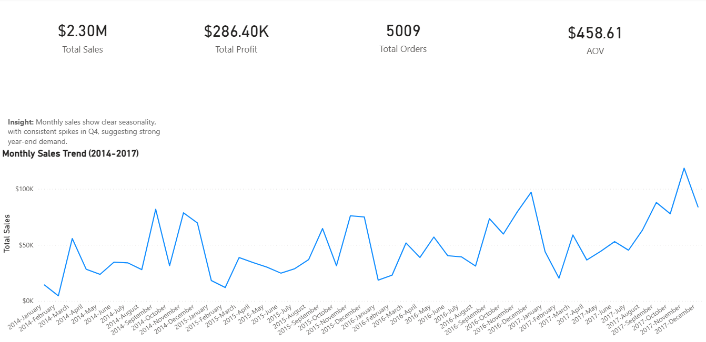

# Superstore Sales Analysis (Power BI)

## Project Overview
This project analyzes historical sales data from a retail superstore to identify trends in revenue, profitability, and customer purchasing behavior.

Using Power BI, I built an interactive KPI dashboard and a time-series analysis focused on clear data modeling, accurate DAX calculations, and business-oriented insights.

---

## Dataset
- Source: Sample Superstore dataset
- Format: CSV
- Records: Approximately 1,000 rows
- Time Period: 2014–2017

Dataset location: data/Sample-Superstore.csv


---

## Dashboard Preview


---

## Key Metrics
The dashboard includes the following KPIs:

- Total Sales
- Total Profit
- Total Orders
- Average Order Value (AOV)

Key DAX measures used:
```DAX
Total Sales = SUM('Sample - Superstore'[Sales])

Total Profit = SUM('Sample - Superstore'[Profit])

Total Orders = DISTINCTCOUNT('Sample - Superstore'[Order ID])

AOV = DIVIDE([Total Sales], [Total Orders])
```

## Key Insight

Monthly sales show clear seasonality, with consistent spikes in Q4, suggesting strong year-end demand driven by holiday purchasing behavior.


This insight was derived using a correctly ordered monthly time series based on a custom Year–Month sorting column to ensure accurate chronological analysis.

## Tools and Skills Demonstrated

- Power BI Desktop
- Power Query (data cleaning and transformation)
- DAX (KPI calculations)
- Time-series analysis
- Dashboard layout and visual design
- Business-focused data interpretation


## Project Structure

superstore-powerbi-analysis/
├── data/
│   └── Sample-Superstore.csv
│
├── dashboard/
│   ├── superstore_sales_dashboard.pbix
│   └── dashboard_overview.png
│
├── README.md


## How to Use

Clone or download the repository

Open the PBIX file in Power BI Desktop

Explore the dashboard and interact with the visuals

## Notes

This project prioritizes clarity, correctness, and business relevance over excessive visual complexity.

The dashboard image provides a quick preview for users without Power BI installed.

## Author

Alejandro Suarez
Data Analytics Portfolio Project